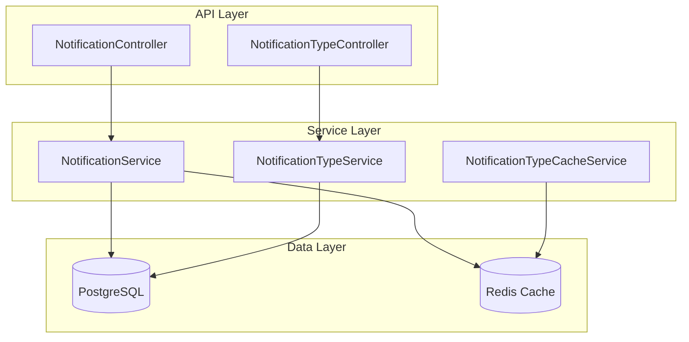
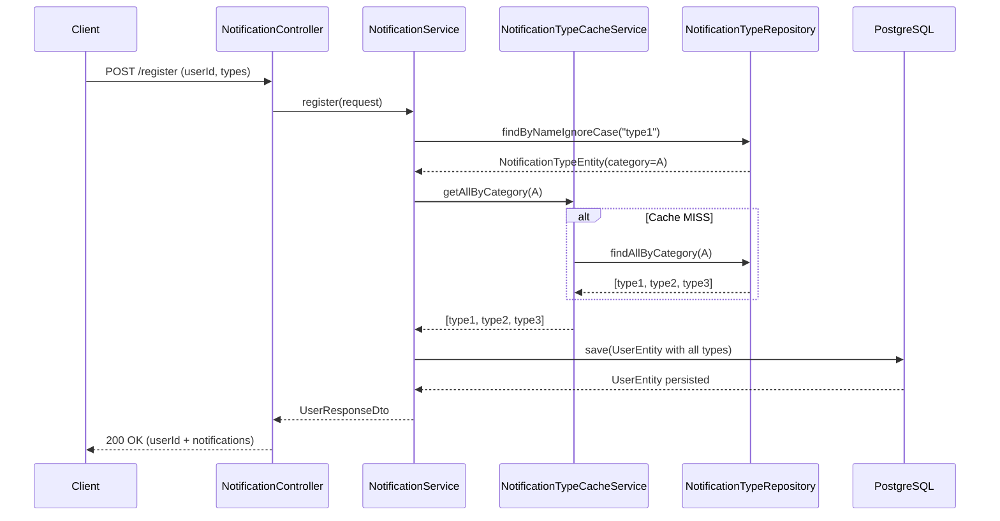

# Read Me First

All the information about the code challenge is in [CODE_CHALLENGE.md](./CODE_CHALLENGE.md)

# Getting Started

1. start docker-compose with postgres
2. start the app
3. Hit the following endpoints to test the service:

```bash
curl -X POST -H "Content-Type: application/json" localhost:8080/register -d '{ "id": "bcce103d-fc52-4a88-90d3-9578e9721b36", "notifications": ["type1","type5"]}'
curl -X POST -H "Content-Type: application/json" localhost:8080/notify -d '{ "userId": "bcce103d-fc52-4a88-90d3-9578e9721b36", "notificationType": "type5", "message": "your app rocks!"}'
```


# 📨 Code Challenge — Notification Service

## 🔖 Overview

This project implements a **Notification Management Service** built with **Kotlin** and **Spring Boot 3.5**.
The system allows users to register for notification categories and receive notifications based on their preferences.

The implementation demonstrates:

* Clean architectural layering (`Controller → Service → Repository`)
* Proper exception handling
* Caching with Redis
* Database schema management via Liquibase
* Integration and unit testing using Testcontainers
* Production-ready configuration with environment-based profiles

---

## 🧱 Architecture Overview



---

## 🔄 Sequence Diagram — `/register` Flow



---

## ⚙️ Tech Stack

| Category      | Technologies                                                 |
| ------------- | ------------------------------------------------------------ |
| Language      | Kotlin 2.2, Java 21                                          |
| Framework     | Spring Boot 3.5 (Web, Data JPA, Validation, Cache, Actuator) |
| Database      | PostgreSQL + Liquibase migrations                            |
| Cache         | Redis (Spring Cache abstraction)                             |
| Messaging     | Kafka (listener placeholder for real-world scaling)          |
| Testing       | JUnit 5, Mockk, Testcontainers (PostgreSQL)                  |
| Build         | Gradle Kotlin DSL                                            |
| Deployment    | Docker, Docker Compose                                       |
| Documentation | Swagger / OpenAPI (springdoc)                                |

---

## 🚀 Getting Started

### **1️⃣ Run with Docker Compose**

```bash
docker-compose up --build
```

Services started:

* PostgreSQL → `localhost:5432`
* Redis → `localhost:6379`
* App → `localhost:8080`

Default profile: **dev**

---

### **2️⃣ Swagger UI**

Once the app is running, open:

🔗 **[http://localhost:8080/swagger-ui.html](http://localhost:8080/swagger-ui.html)**

---

### **3️⃣ Sample API Requests**

#### **1. Register a User**

**POST** `/register`

**Request:**

```json
{
  "id": "bcce103d-fc52-4a88-90d3-9578e9721b36",
  "notifications": ["type1", "type5"]
}
```

**Response:**

```json
{
  "id": "bcce103d-fc52-4a88-90d3-9578e9721b36",
  "notifications": ["type1", "type5"]
}
```

---

#### **2. Send a Notification**

**POST** `/notify`

**Request:**

```json
{
  "userId": "bcce103d-fc52-4a88-90d3-9578e9721b36",
  "notificationType": "type5",
  "message": "Your app rocks!"
}
```

**Response:**
`200 OK` (Log message emitted via structured logging)

---

#### **3. Create a Notification Type**

**POST** `/notification-types`

**Request:**

```json
{
  "name": "type6",
  "category": "A"
}
```

**Response:**

```json
{
  "id": "0e3d5f64-8652-4f70-9953-7b822d2e674f",
  "name": "type6",
  "category": "A"
}
```

---

## 🧠 Business Logic Summary

| Scenario                                 | Behavior                                                                               |
| ---------------------------------------- | -------------------------------------------------------------------------------------- |
| User registers for a type (e.g. `type1`) | Automatically subscribes to **all types in that category** (`type1`, `type2`, `type3`) |
| New type added to category               | Users registering later automatically get it; existing users can be synced easily      |
| Notification sent                        | Delivered only if user is subscribed to that category                                  |
| Category caching                         | Category → Notification types mapping cached in Redis                                  |
| Validation                               | DTOs validated via Jakarta Validation annotations                                      |
| Errors                                   | Handled via `GlobalRestExceptionHandler`                                               |

---

## 🥪 Testing Strategy

### **Unit Tests**

* Written using **Mockk** and **JUnit 5**
* Cover `NotificationService` and `NotificationTypeService` core logic

### **Integration Tests**

* Use **Spring Boot Test + Testcontainers**
* PostgreSQL container dynamically configured via `@DynamicPropertySource`
* Common setup provided by `AbstractIntegrationTestBase`

### Example

```kotlin
@Test
fun registerUser_shouldReturnOk() {
    val user = UserRegisterRequestDto(UUID.randomUUID(), mutableSetOf("type1"))
    val response = sendPostRequest("/register", user, UserRegisterRequestDto::class.java)
    assertEquals(HttpStatus.OK, response.statusCode)
}
```

---

## 🗂️ Configuration Profiles

| Profile   | Description                                           |
| --------- | ----------------------------------------------------- |
| `dev`     | Local development, verbose SQL logs                   |
| `staging` | CI/CD testing, environment variables for DB/Redis     |
| `prod`    | Optimized, Redis cache enabled, Kafka listener active |

---

## 🐳 Docker Configuration

`docker-compose.yml` runs:

* `postgres:15`
* `redis:7`
* `code-challenge` app

Environment variables:

```yaml
SPRING_PROFILES_ACTIVE: dev
DB_HOST: postgres
REDIS_HOST: redis
DB_USER: postgres
DB_PASSWORD: postgres
```

---

## 🤰 Build and Run Locally

```bash
./gradlew clean build
java -jar build/libs/be-coding-challenge-burak-0.0.1-SNAPSHOT.jar
```

Then visit:
🖉 `http://localhost:8080/actuator/health` → `{ "status": "UP" }`
🖉 `http://localhost:8080/swagger-ui.html` → API documentation

---

## 🥉 Exception Handling

Centralized via `GlobalRestExceptionHandler`:

| Exception                         | HTTP Status | Example Message                                  |     |
| --------------------------------- | ----------- | ------------------------------------------------ | --- |
| `MethodArgumentNotValidException` | 400         | `name: must not be null; category: must match 'A | B'` |
| `IllegalArgumentException`        | 400         | `Invalid category 'C'`                           |     |
| `NoSuchElementException`          | 404         | `User not found`                                 |     |
| `Exception`                       | 500         | `Please try again later`                         |     |

---

## ⚡ Scalability & Production Readiness

| Area                       | Implementation                                       |
| -------------------------- | ---------------------------------------------------- |
| **Stateless Architecture** | Yes, app instances can scale horizontally            |
| **Cache Layer**            | Redis for shared caching between instances           |
| **Observability**          | Spring Boot Actuator endpoints enabled               |
| **Database migrations**    | Managed via Liquibase                                |
| **Containerization**       | Dockerfile + Compose ready for deployment            |
| **Resilience**             | Safe exception handling and transactional integrity  |
| **Logging**                | Structured (SLF4J) logs for ELK/CloudWatch ingestion |

---

## 🥉 Project Structure

```
src/
├── main/
│   ├── kotlin/
│   │   └── de/dkb/api/codeChallenge/
│   │       ├── notification/
│   │       │   ├── controller/
│   │       │   ├── service/
│   │       │   ├── model/
│   │       │   ├── repository/
│   │       │   └── messaging/
│   │       └── common/
│   │           ├── exception/
│   │           └── mapper/
│   └── resources/
│       ├── db/changelog/
│       ├── application.yaml
│       └── application-*.yaml
└── test/
    ├── integration/
    └── service/
```

---
## Considerations  
During implementation, both unit tests and integration tests were added to validate the business logic and API endpoints.
However, due to environment configuration and dependency issues, the integration tests could not be fully executed. It said that Class was not found for testClasses. 
Despite this, all necessary test structures, container setups, and test data preparation logic are in place for future execution.

This ensures that the project remains test-ready, and the test suite can be run successfully once the environment setup is completed.

## 🚀 Future Improvements

While the current implementation fulfills the challenge requirements, several improvements can make the system even more scalable, maintainable, and production-ready in real-world scenarios:

| Area | Potential Improvement | Description |
|------|-----------------------|--------------|
| **Testing** | ✅ Finalize Integration Test Execution | Fix environment setup to ensure Testcontainers can run in all environments (e.g., Jenkins, CI pipelines). Add additional test cases for edge scenarios like invalid notification types and empty category sets. |
| **Error Handling** | 💡 Expand Error Model | Introduce standardized error codes and i18n messages for better API consistency across teams. |
| **API Documentation** | 🧾 Extend Swagger Metadata | Add richer OpenAPI descriptions, request/response examples, and grouped tags to make API documentation more developer-friendly. |
| **Notifications Flow** | 🔔 Kafka Integration | Replace the in-memory consumer with a fully operational Kafka-based event-driven flow for large-scale asynchronous processing. |
| **Performance** | ⚡ Caching Enhancements | Add cache invalidation strategies and metrics to monitor Redis hit/miss ratios; potentially introduce Caffeine as a local L2 cache. |
| **Security** | 🔐 Authentication & Authorization | Secure endpoints using JWT or OAuth2 for user and system-level access control. |
| **Observability** | 📈 Monitoring & Alerts | Integrate distributed tracing (e.g., Zipkin or OpenTelemetry) and centralized log collection for better debugging and observability. |
| **DevOps** | 🐳 CI/CD Automation | Implement a GitHub Actions pipeline to automate build, test, lint, and container deployment steps. |
| **Data Consistency** | 🧩 Migration Scripts | Introduce automatic user synchronization logic to handle new notification types added after initial registration. |


 🧩 NotificationTypeController API Extensions

| Operation                                     | Needed?           | Explanation                                                                       |
| --------------------------------------------- | ----------------- | --------------------------------------------------------------------------------- |
| **POST /notification-types**                  | ✅ Required        | Creates a new notification type (already implemented).                            |
| **GET /notification-types**                   | ✅ Recommended     | Useful for listing existing notification types for admin or debugging purposes.   | |
| **PATCH /notification-types/{id}/deactivate** | ⚙️ Optional       | A soft deactivation endpoint could be added for better type management.           |
